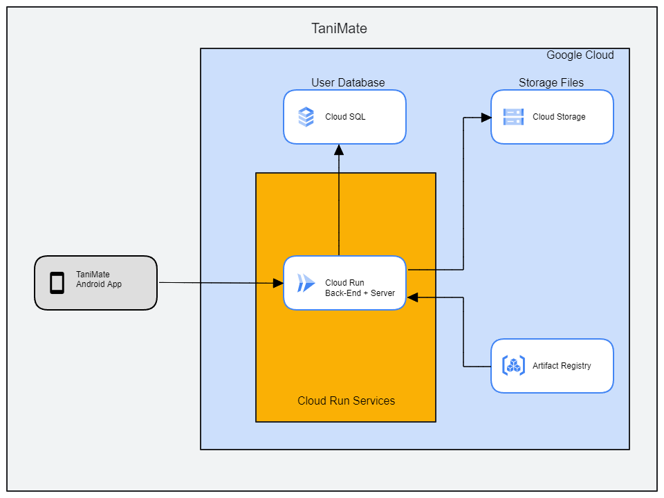

# Deploying to GCP

GCP services used:

- Cloud Run
- Cloud SQL
- Artifact Registry
- Cloud Storage

# GCP Architecture



# Set Environment Variables and Enable Services
```bash
export PROJECT_ID=$(gcloud config get-value project)
export PROJECT_NUMBER=$(gcloud projects describe $PROJECT_ID --format='value(projectNumber)')
export REGION=asia-southeast1

gcloud services enable \
    run.googleapis.com \
    storage.googleapis.com \
    artifactregistry.googleapis.com \
    sqladmin.googleapis.com
```

# Artifact Registry
Push and Pull Images [here](https://cloud.google.com/artifact-registry/docs/docker/pushing-and-pulling?authuser=3)
