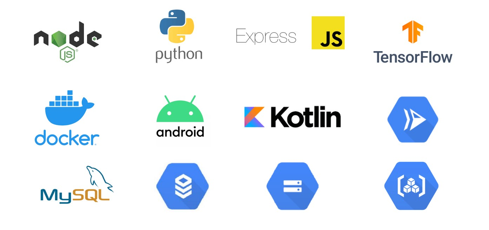

# TaniMate
Bangkit Capstone Project C23-PS189

# Overview
This application will provide features that help farmers in selecting plant seeds, scheduling harvests, and calculating fertilizer requirements based on the type of plant, land size, and soil conditions. In addition, the application also provides weather forecasts and current agricultural information that can help farmers in planning their agricultural activities.

# Project Team Member
| Name  | Cohort ID | Learning Path      |
|-------|------|-----------|
| Alzi Islamey Malano  | M181DSX3600   | Machine Learning   |
| Elrafha Wilmar  | M181DKX3759   | Machine Learning   |
| Randy Rizki Ananda  | C168DSX4850   | Cloud Computing  |
| Restu Maulana Fadhillah  | C168DSX3630   | Cloud Computing  |
| Tri Ayunia Patma Lubis  | A137DSY0996   | Mobile Development  |
| Muhammad Khalid Assiddiq  | A137DKX4019   | Mobile Development  |

# Tech Stack

# Library used for Android Application
1. [Retrofit](https://square.github.io/retrofit/)
2. [tflite](https://www.tensorflow.org/lite?hl=id)
3. [Logging Interceptor](https://square.github.io/okhttp/3.x/logging-interceptor/index.html?okhttp3/logging/HttpLoggingInterceptor.html)

# Library used for Back-End System (Node.js with NPM)
1. [Express JS](https://expressjs.com/)
2. [Mysql](https://www.npmjs.com/package/mysql)
3. [JsonWebToken](https://www.npmjs.com/package/jsonwebtoken)
4. [Bcrypt](https://www.npmjs.com/package/bcrypt)
5. [Dotenv](https://www.npmjs.com/package/dotenv)

# Library used for Machine Learning
1. [Python](https://www.python.org/)
2. [TensorFlow](https://www.tensorflow.org/)
3. [Pandas](https://pandas.pydata.org/)
4. [NumPy](https://numpy.org/)
5. [scikit-learn](https://scikit-learn.org/)

# Prototype
You can see it [here](https://www.figma.com/file/gh6yJNON3OoaMvkhsxBjJA/Capstone-Project-(TaniMate)-team-library?type=design&node-id=1840%3A642&t=97RVvhprK9sbCp1H-1)

# Deploying to GCP
For documentation on deploying to GCP, check this [document](https://github.com/ttrrayl/TaniMate/blob/master/Cloud%20Computing/docs/gcp_deploy.md)

# Future Development
TBD
